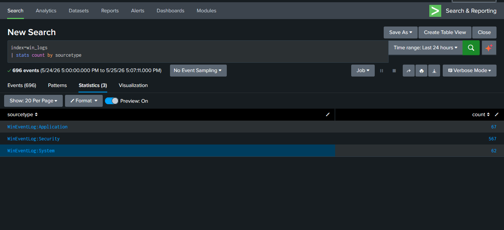
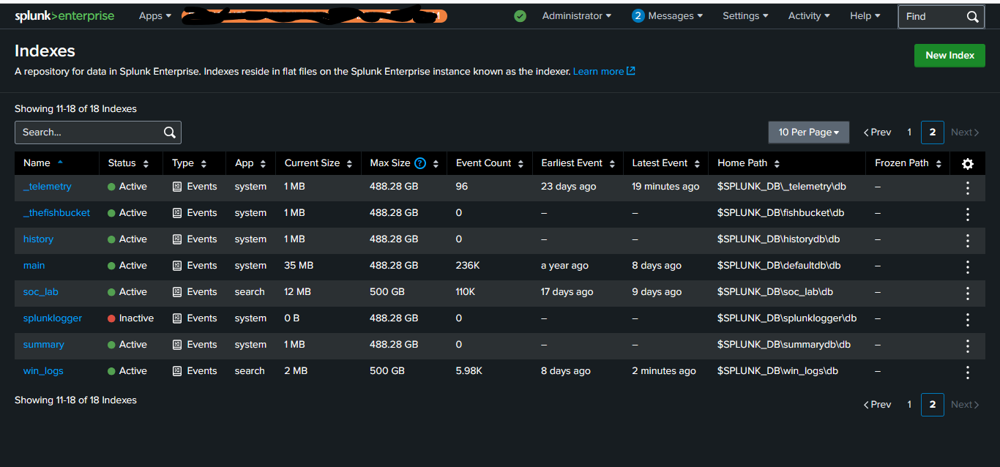
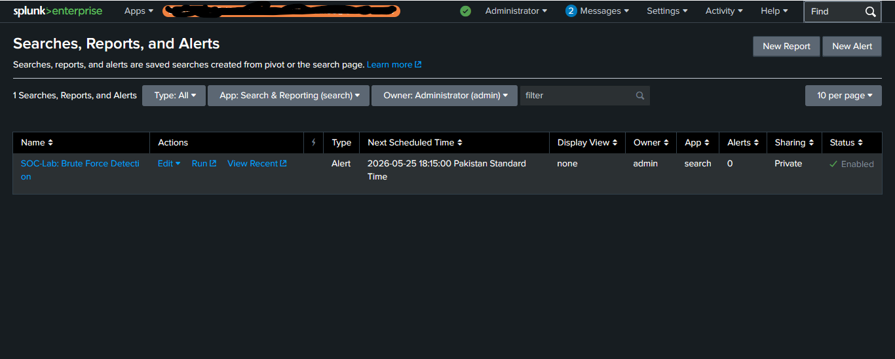
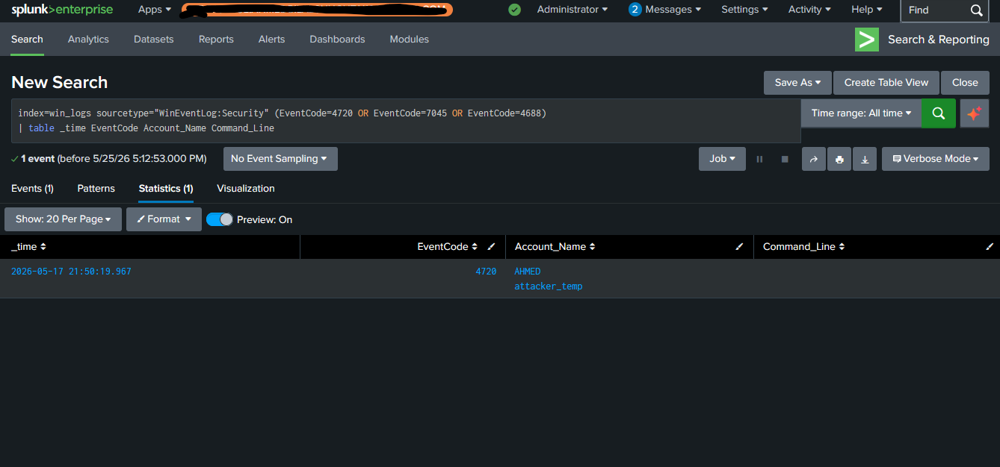
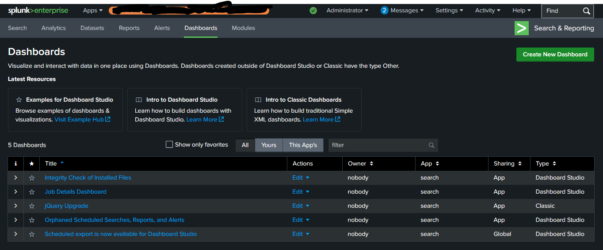

# 🏗️ SOC Home Lab Architecture

## Overview
A fully functional Security Operations Center lab built from scratch for hands-on detection engineering, log analysis, and incident response practice. All attacks are simulated, all detections are real, all evidence is documented.

---

## Lab Architecture Diagram

┌──────────────────────┐ ┌──────────────────────────┐
│ Kali Linux VM │──────▶│ Windows 10 (Splunk) │
│ │ │ │
│ Role: Attacker │ │ Role: SIEM + Victim │
│ • Brute Force │ │ • Splunk Enterprise │
│ • Network Recon │ │ • Log Collection │
│ • Attack Scripts │ │ • Alert Generation │
│ │ │ │
└──────────────────────┘ └──────────────────────────┘
│
│ Log Sources:
│ • Windows Event Logs
│ - Security (4624, 4625, 4688)
│ - System (7045, 7036)
│ - Application
│ • Tutorial Sample Data
│
│ Custom Indexes:
│ • win_logs
│ • soc_lab
│
▼
┌────────────────────────┐
│ Splunk SIEM │
│ Developer License │
│ │
│ 📊 Live Dashboard │
│ 🚨 6 Alert Rules │
│ 📋 Saved Reports │
│ 🔍 SPL Search Library│
└────────────────────────┘

---

## Component Breakdown

### 1. SIEM: Splunk Enterprise
| Detail | Value |
|--------|-------|
| **Version** | Splunk Enterprise (Developer License) |
| **Access** | `http://localhost:8000` |
| **License Type** | Dev License (10GB/day, full features) |
| **Custom Indexes** | `win_logs` (Windows Events), `soc_lab` (Sample Data) |
| **Capabilities** | SPL searches, dashboards, alerts, reports, data ingestion |

### 2. Log Source 1: Windows Event Logs
| Detail | Value |
|--------|-------|
| **Collection Method** | Splunk Local Event Log Monitor |
| **Logs Collected** | Security, System, Application |
| **Target Index** | `win_logs` |
| **Key Event IDs** | 4624, 4625, 4688, 4720, 4672, 1102, 7045 |

### 3. Log Source 2: Tutorial Sample Data
| Detail | Value |
|--------|-------|
| **Collection Method** | File Upload |
| **Data Types** | Web access logs, authentication logs |
| **Target Index** | `soc_lab` |
| **Purpose** | Additional practice data for search and analysis |

### 4. Attack Simulator: Kali Linux VM
| Detail | Value |
|--------|-------|
| **Platform** | Kali Linux (VirtualBox VM) |
| **Role** | Generate attack telemetry against Windows host |
| **Attack Types** | RDP brute force (Hydra), network recon (Nmap), SMB enumeration |

---

## Data Flow Verification

### Active Log Ingestion

*Windows Event Logs actively flowing into custom `win_logs` index*

### Custom Index Management

*Dedicated indexes for organized log management and efficient searching*

---

## Detection Engineering

### Detection Rules Deployed
| # | Rule Name | Event ID | Severity | MITRE ATT&CK |
|---|-----------|----------|----------|--------------|
| 1 | Brute Force Detection | 4625 | Medium/High | T1110 |
| 2 | Encoded PowerShell | 4688 | High | T1059.001 |
| 3 | New User Created | 4720 | High | T1136.001 |
| 4 | New Service Installed | 7045 | High | T1543.003 |
| 5 | Audit Log Cleared | 1102 | Critical | T1070.001 |
| 6 | Special Privileges Assigned | 4672 | Medium | T1068 |

### Detection Rule Configuration

*Custom SPL detection rule configured and active in Splunk*

---

## Attack Simulation & Validation

### Methodology
1. Launch attack from Kali Linux against Windows host
2. Windows Event Logs capture the activity
3. Splunk ingests logs into `win_logs` index
4. Detection rules fire based on configured thresholds
5. Alerts appear in Splunk for triage

### Attack Evidence Captured

*Simulated attack events detected: user creation (4720), service installation (7045), encoded PowerShell (4688)*

---

## Dashboard Architecture

### SOC Monitoring Dashboard
| Panel | Visualization | Purpose |
|-------|---------------|---------|
| Failed Logons (24h) | Column Chart | Detect brute force patterns |
| Top Failed Accounts | Bar Chart | Identify most targeted users |
| Suspicious Processes | Table | Detect encoded PowerShell and LOLBins |
| New Users Created | Table | Catch unauthorized account creation |
| New Services | Table | Detect malware persistence |
| Triggered Rules | Table | Monitor detection rule activity |

### Live Dashboard

*7-panel SOC monitoring dashboard with live data*

---

## Skills Demonstrated

| Skill Category | Specific Skills |
|----------------|-----------------|
| **SIEM Administration** | Splunk installation, index creation, log source integration, license management |
| **Log Engineering** | Windows Event Log collection, sourcetype configuration, data pipeline management |
| **Detection Engineering** | Custom SPL queries, MITRE ATT&CK mapping, alert threshold tuning |
| **Attack Simulation** | Kali Linux attack tools, brute force simulation, network reconnaissance |
| **Dashboard Design** | SOC monitoring layout, visualization selection, real-time data panels |
| **Documentation** | Architecture diagrams, component breakdowns, evidence collection |

---

## Lab Evolution

### Challenges Overcome
1. **Sysmon download issues** → Used Windows Security Event Logs as primary telemetry source
2. **Free license limitations** → Upgraded to Developer License for full alerting capabilities
3. **Single machine constraints** → Ran Splunk on Windows host as both SIEM and log source
4. **Kali remote access failures** → Simulated attacks locally via PowerShell when necessary

### Future Enhancements
- [ ] Integrate Sysmon for enriched process telemetry
- [ ] Add Linux syslog forwarding from Kali
- [ ] Deploy firewall log simulator
- [ ] Create automated response playbooks
