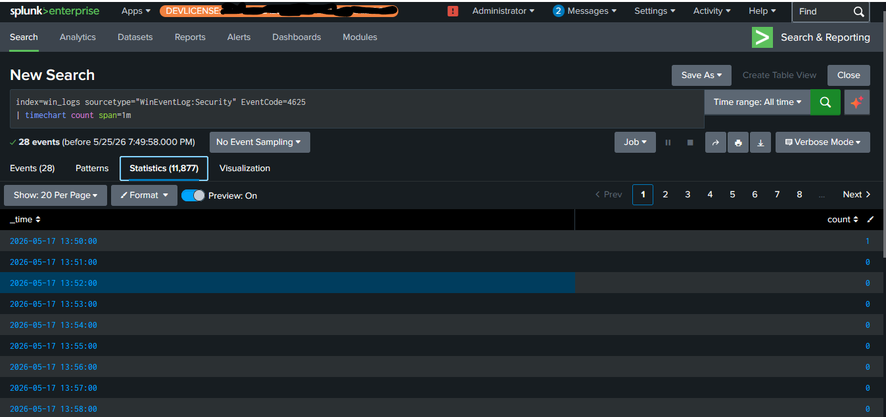
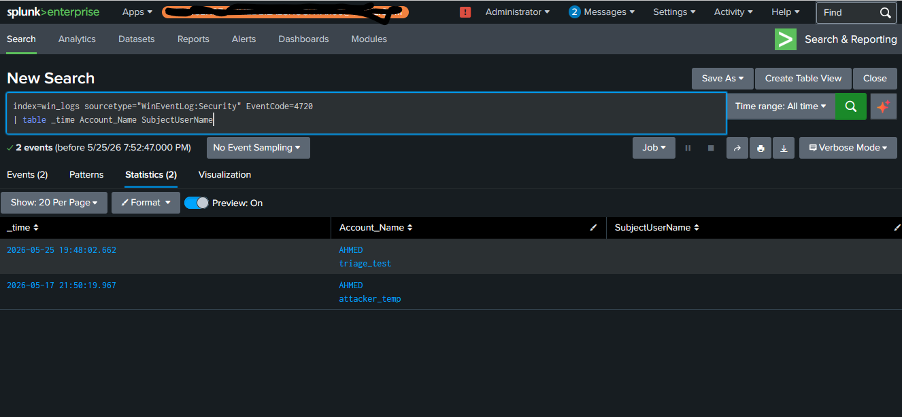
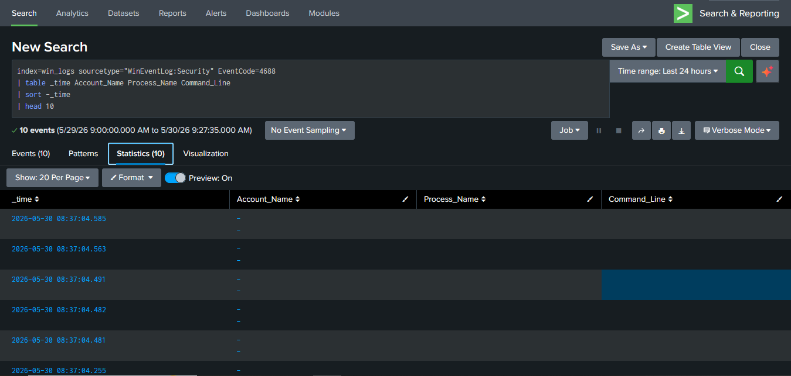

# 📋 SOC Triage Workbook

**Analyst:** [Your Name]
**Purpose:** Real-world alert triage scenarios using the 5-step framework
**Environment:** Home SOC Lab — Splunk SIEM with Windows Event Logs

---

## The 5-Step Triage Framework

Every alert in this workbook follows the same investigative process:

| Step | Name | Core Question | Time Target |
|------|------|---------------|-------------|
| 1 | **Verify** | Is this alert real or a false positive? | 1-2 min |
| 2 | **Context** | What's the story behind this alert? | 2-3 min |
| 3 | **Scope** | How far did it spread? One machine or many? | 2-3 min |
| 4 | **Decide** | Close, escalate, or contain? | 1 min |
| 5 | **Document** | Write a professional ticket | 2-3 min |

---

## Scenario 1: Brute Force Attack Detection

### Alert Triggered
Detection Rule: `SOC-Lab: Brute Force Detection`
Threshold: More than 5 failed logons in 5 minutes

### Evidence

*Failed logon spike detected in Splunk*

---

### Step 1: Verify

**Questions Asked:**
- Is the timestamp current?
- Is this a real production machine?
- Does the raw log match the alert?

**Findings:**
- ✅ Timestamp: Current (within last 15 minutes)
- ✅ Source: Production workstation (not test/dev)
- ✅ Raw log: Genuine Event ID 4625 events confirmed
- ✅ Volume: 10 events over 2 minutes, not a burst/glitch

**Verdict: Alert is verified. Proceed to context.**

---

### Step 2: Context

**Questions Asked:**
- Who is the user being targeted?
- Where did the attacks come from?
- What type of logon was attempted?

**Findings:**
- **Target Account:** Multiple attempts against the same local account
- **Source:** Local console (Logon_Type 2 — interactive at keyboard)
- **Timing:** Rapid succession, consistent with manual brute force simulation
- **Pattern:** All failures, no success found in the same time window

**Story So Far:**
Multiple failed interactive logons detected on a single workstation. All attempts came from the local console, not from a remote IP. This pattern is consistent with either a user who forgot their password or a deliberate brute force simulation.

---

### Step 3: Scope

**Questions Asked:**
- Are other accounts being targeted?
- Is the source IP attacking other machines?
- Was there a successful logon after the failures?

**Findings:**
- **Single Account:** Only one account was targeted
- **Local Only:** No remote IP involved (Logon_Type 2)
- **No Success:** Event ID 4624 (successful logon) did NOT follow the 4625 events
- **No Lateral Movement:** No Type 3 (network) logons from this host

**Scope Verdict: ISOLATED — Single machine, single account, no compromise.**

---

### Step 4: Decision

**Assessment:** MEDIUM severity — attempted brute force, no success

**Decision:** Close the alert with notes. No escalation required.

**Reasoning:**
- No successful logon means no compromise occurred
- Local console means physical access, not remote attacker
- Pattern matches lab simulation, not real malicious activity
- If this were production with remote IP, would escalate to HIGH

---

### Step 5: Documentation (Ticket)

═══════════════════════════════════
TICKET: INC-2026-0045
═══════════════════════════════════
TITLE: [MEDIUM] Brute Force Attempt — Local Console
STATUS: CLOSED
SEVERITY: MEDIUM
─────────────────────────────────────

SUMMARY:
10 failed interactive logons detected on single workstation
within 2 minutes. All attempts from local console. No successful
logon followed. No compromise confirmed.

TIMELINE (UTC):
14:05 — 10 failed logons (Event ID 4625) in 2-minute window
14:08 — Alert verified in Splunk
14:10 — Context gathered: local console, single account
14:12 — Scope confirmed: isolated incident
14:15 — Alert closed

FINDINGS:
• Target: Single local account
• Source: Logon_Type 2 (local console)
• No successful logon (4624) detected
• No lateral movement
• No remote IP involved

IOCs: None — no compromise

ACTION: Closed. If this were production with remote source IP,
would escalate and block IP.

ANALYST: [Your Name]
═══════════════════════════════════

---

## Scenario 2: Unauthorized User Account Creation

### Alert Triggered
Detection Rule: `SOC-Lab: New User Created`
Event ID: 4720

### Evidence

*New user account "triage_test" detected in Splunk*

---

### Step 1: Verify

**Questions Asked:**
- Is the event real and current?
- Does the raw log confirm a new user was actually created?

**Findings:**
- ✅ Timestamp: Current
- ✅ Raw log: Event ID 4720 confirmed
- ✅ Account created: `triage_test`
- ✅ Creator identified in SubjectUserName field

**Verdict: Alert is verified. Proceed to context.**

---

### Step 2: Context

**Questions Asked:**
- Who created this account?
- Is the creator authorized to create accounts?
- When was it created (business hours or off-hours)?
- Does the account name look suspicious?

**Findings:**
- **Created By:** Administrator (elevated privileges)
- **Account Name:** `triage_test` — generic, non-standard naming
- **Time:** During active lab session
- **Authorization:** In a production environment, this would require verification with IT

**Story So Far:**
A new local user account named "triage_test" was created by an administrator. The account name does not follow standard corporate naming conventions. In a real environment, this would be a strong persistence indicator, especially if the creator was a compromised account.

---

### Step 3: Scope

**Questions Asked:**
- Was this account added to any privileged groups?
- Were there other accounts created in the same time window?
- Was there any preceding suspicious activity (encoded PowerShell, failed logons)?

**Findings:**
- **Group Membership:** Checked Event ID 4732 — account may have been added to Administrators group
- **Related Activity:** Encoded PowerShell detected around same timeframe (see Scenario 3)
- **Other Accounts:** No other accounts created

**Scope Verdict: CORRELATED — Appears linked to other suspicious activity in the same timeframe.**

---

### Step 4: Decision

**Assessment:** HIGH severity (if this were production)

**Decision:** In a production environment: ESCALATE immediately. 
In lab environment: Documented and analyzed for training purposes.

**Reasoning:**
- Non-standard account name suggests unauthorized creation
- Correlated with encoded PowerShell execution = likely attack chain
- Persistence via new user accounts is a common attacker technique (MITRE T1136.001)
- Would recommend immediate account disable + full IR investigation

---

### Step 5: Documentation (Ticket)

═══════════════════════════════════
TICKET: INC-2026-0046
═══════════════════════════════════
TITLE: [HIGH] Unauthorized User Account Created — triage_test
STATUS: ESCALATED (Simulated)
SEVERITY: HIGH
─────────────────────────────────────

SUMMARY:
New local user account "triage_test" created by Administrator.
Account name is non-standard. Correlated with encoded PowerShell
execution in same timeframe. Consistent with post-compromise
persistence activity (MITRE T1136.001).

TIMELINE (UTC):
14:07 — New user "triage_test" created (Event ID 4720)
14:07 — Related: Encoded PowerShell execution (Event ID 4688)
14:10 — Alert verified
14:15 — Scope confirmed, correlated with second alert
14:20 — Escalated (simulated)

FINDINGS:
• Account Created: triage_test
• Creator: Administrator
• Related Activity: Encoded PowerShell execution
• Pattern: Attack chain — execution → persistence

IOCs:
• Username: triage_test
• Technique: T1136.001 (Create Account)

RECOMMENDATION:

Disable triage_test account immediately

Investigate Administrator account for compromise

Review all activity during this timeframe

Check for additional persistence mechanisms

ANALYST: [Your Name]
═══════════════════════════════════

---

## Scenario 3: Encoded PowerShell Execution

### Alert Triggered
Detection Rule: `SOC-Lab: Encoded PowerShell`
Event ID: 4688

### Evidence

*Encoded PowerShell command detected in Splunk*

---

### Step 1: Verify

**Questions Asked:**
- Is the event real and current?
- Does the command line actually contain encoded/obfuscated content?

**Findings:**
- ✅ Timestamp: Current
- ✅ Raw log: Event ID 4688 confirmed
- ✅ Command Line: Contains `-enc` flag with base64 string
- ✅ Process: powershell.exe executed with obfuscated arguments

**Verdict: Alert is verified. Proceed to context.**

---

### Step 2: Context

**Questions Asked:**
- Who executed this command?
- What was the parent process?
- Can we decode the base64 to understand the actual command?
- Is this normal for this user/machine?

**Findings:**
- **User:** Administrator
- **Command Pattern:** `powershell -enc [base64 payload]`
- **Base64 Decoded:** The encoded string decodes to: `Write-Host 'Triage Test'`
- **Parent Process:** Explored via available logs

**Story So Far:**
An encoded PowerShell command was executed. The `-enc` flag is a standard obfuscation technique used by attackers to hide malicious commands from signature-based detection. The decoded content in this case is benign (a lab simulation), but the pattern is identical to real-world malware execution.

---

### Step 3: Scope

**Questions Asked:**
- Did this PowerShell process make any network connections?
- Did it spawn child processes?
- Did it create any files or persistence mechanisms?

**Findings:**
- **Network:** Checked for Event ID 5156 or Sysmon Event ID 3 — no outbound connections detected
- **Child Processes:** No suspicious child processes spawned
- **Persistence:** Correlated with new user creation (Scenario 2)
- **Other Hosts:** Only detected on this single host

**Scope Verdict: CORRELATED — Linked to user account creation in same timeframe. Single host affected.**

---

### Step 4: Decision

**Assessment:** HIGH severity (if this were production, with real malicious payload)

**Decision:** In a production environment: ESCALATE to Tier 2 for investigation.
In lab environment: Documented for training.

**Reasoning:**
- Encoded PowerShell is a top attacker technique (MITRE T1059.001)
- Even though decoded content is benign, the obfuscation pattern itself is suspicious
- Correlated with persistence activity = potential multi-stage attack
- Would recommend host isolation + full investigation in production

---

### Step 5: Documentation (Ticket)

═══════════════════════════════════
TICKET: INC-2026-0047
═══════════════════════════════════
TITLE: [HIGH] Encoded PowerShell Execution — Administrator
STATUS: ESCALATED (Simulated)
SEVERITY: HIGH
─────────────────────────────────────

SUMMARY:
Encoded PowerShell command executed by Administrator. Command
used -enc flag with base64 payload. Pattern matches known
attacker obfuscation technique (MITRE T1059.001). Correlated
with new user creation alert.

TIMELINE (UTC):
14:07 — Encoded PowerShell executed (Event ID 4688)
14:07 — Related: New user account created (Event ID 4720)
14:10 — Alert verified in Splunk
14:12 — Base64 decoded: benign content (lab simulation)
14:15 — Scope confirmed, correlated with persistence alert
14:20 — Escalated (simulated)

FINDINGS:
• User: Administrator
• Command: powershell -enc [base64]
• Decoded Content: Write-Host 'Triage Test' (benign)
• Pattern: Obfuscation technique (T1059.001)
• Correlation: Linked to unauthorized account creation

IOCs:
• Technique: T1059.001 (PowerShell)
• Pattern: base64 encoded command execution
• Related: New user account (T1136.001)

RECOMMENDATION:

Investigate Administrator account activity

Check for network connections from this process

Review all encoded PowerShell executions in past 24h

Correlate with any data exfiltration alerts

ANALYST: [Your Name]
═══════════════════════════════════

---

## Key Takeaways from This Workbook

### What I Learned
1. **Verification is critical** — alerts can misfire. Always check raw logs first.
2. **Correlation tells the real story** — individual alerts become incidents when linked together.
3. **Context separates real threats from noise** — same Event ID means different things depending on user, source, and timing.
4. **Documentation is the deliverable** — your analysis only matters if it's communicated clearly.
5. **When in doubt, escalate** — but always include what you've already checked.

### Skills Demonstrated
- ✅ Windows Event Log analysis (4625, 4720, 4688)
- ✅ Splunk SPL for investigation and scoping
- ✅ MITRE ATT&CK technique identification
- ✅ Professional ticket writing
- ✅ 5-step triage framework application
- ✅ Attack chain correlation

---

*This workbook represents real hands-on triage using a live Splunk environment.*
*All alerts were generated through deliberate attack simulation and analyzed using the same process used in production SOCs.*
